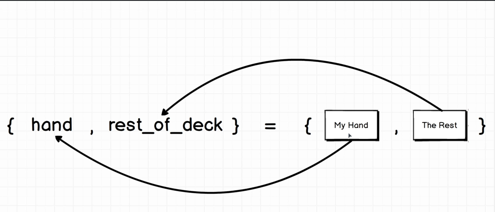

# Elixir Study - The Complete Elixir and Phoenix Bootcamp

This are some notes for the course [The Complete Elixir and Phoenix Bootcamp](https://www.udemy.com/course/the-complete-elixir-and-phoenix-bootcamp-and-tutorial).

## Section 01 - Elixir Warmup

### Mix

- Create a project
- Compile projects
- Run tasks
- Manage dependencies

#### Create

```bash
mix new cards
```

That creates the `cards` folder with initial project.

### Run the code

Inside `cards` folder run:

```bash
iex -S mix
```

The flag `-S` compiles our project.

To access our module we can run `Cards`, and to run our `hello` method we can do `Cards.hello`.

To recompile our code inside `iex` we can run `recompile`.

### Lists and Strings

#### String

```elixir
def hello do
  "Hello world!"
end
```

We can use single quote, but the convention is to use double quotes for all strings.

#### Lists

```elixir
def create_deck do
  ["Ace", "Two", "Three", "Four"]
end
```

### OO vs Functional programing

#### Object approach:


```ts
class Card {
  suit: string;
  value: string;

  constructor(suit: string, value: string) {
    this.suit = suit;
    this.value = value;
  }
}
```

```ts
class Deck {
  cards: Array<string>;
  constructor(cards: Array<string>) {
    this.cards = cards;
  }

  shuffle() {
    // Shuffle this.cards property
  }
  save() {}
  load() {}
}
```

We need to create a class instance to operate on it's values:

```ts
const cards = ['Ace', 'Two', 'Three'];
const deck = new Deck(cards); // Create Deck instance

deck.cards; // Gets the original array ["Ace", "Two", "Three"]
deck.shuffle(); // Shuffle the local cards property
deck.cards; // Now our cards property got mutated
```

#### FP Approach:


Here we don't have classes and the concept of `instance` of a class.

We have data structures, methods that accept them and output new data structures, they don't mutate the original ones.

Here we have a `create_deck` method that returns a list of cards:

```elixir
defmodule Cards do
  def create_deck do
    ["Ace", "Two", "Three", "Four"]
  end
end
```

### Creating new methods

In elixir we can have different methods with the same name, but only change our params types or quantity:

```elixir
defmodule Cards do
  def shuffle do
  end

  def shuffle(deck) do
    Enum.shuffle(deck)
  end
end
```

Then we could run them inside `iex` with:

```elixir
Cards.shuffle
Cards.shuffle(["Ace"])
```

The code above is valid.

### Immutability

Given the code:

```elixir
defmodule Cards do
  def create_deck do
    ["Ace", "Two", "Three", "Four"]
  end

  def shuffle(deck) do
    # https://hexdocs.pm/elixir/Enum.html#shuffle/1
    Enum.shuffle(deck)
  end
end
```

Then we could run inside `iex`:

```elixir
# create cards list
cards = Cards.create_deck

# shuffle it
Cards.shuffle(cards)

# cards will still be the original list
cards
```

Our `cards` variable is immutable.


What happen is that shuffle first copy the list, then shuffle the copy and return it. The original variable was never changed.

### Search a list

By convention if a method contain `?` it will return `true` or `false`:

```elixir
defmodule Cards do
  # ...

  def contains?(deck, hand) do
    # https://hexdocs.pm/elixir/Enum.html#member?/2
    Enum.member?(deck, hand)
  end
end
```

Inside `iex` run:

```elixir
deck = Cards.create_deck

# search
Cards.contains?(deck, "Two") # true
Cards.contains?(deck, "King") # false
```


### Comprehensions Over Lists

We can use a `for` loop for that:

```elixir
def create_deck do
  values = ["Ace", "Two", "Three", "Four", "Five"]
  suits = ["Spades", "Clubs", "Hearts", "Diamonds"]

  for suit <- suits do
    suit
  end
end
```

The `for` will create a new map with each `suit` value.

At first we could think on doing something like this:

```elixir
for value <- values do
  for suit <- suits do
    "#{value} of #{suit}"
  end
end
```

But with this we get one array for each suit:

```
[
  ["Ace of Spades", "Two of Spades", "Three of Spades", "Four of Spades",
   "Five of Spades"],
  ["Ace of Clubs", "Two of Clubs", "Three of Clubs", "Four of Clubs",
   "Five of Clubs"],
  ["Ace of Hearts", "Two of Hearts", "Three of Hearts", "Four of Hearts",
   "Five of Hearts"],
  ["Ace of Diamonds", "Two of Diamonds", "Three of Diamonds",
   "Four of Diamonds", "Five of Diamonds"]
]
```

If we want only one list we can use [List.flatten](https://hexdocs.pm/elixir/List.html#flatten/1):

```elixir
cards = for value <- values do
  for suit <- suits do
    "#{value} of #{suit}"
  end
end
List.flatten(cards)
```

Or a better way is to use:

```elixir
for suit <- suits, value <- values do
  "#{value} of #{suit}"
end
```

### Tuples


```elixir
def deal(deck, hand_size) do
  # https://hexdocs.pm/elixir/Enum.html#split/2
  Enum.split(deck, hand_size)
end
```

The `Enum.split` will return a tuple.


In the next session we will see how to access each element of the tuple.

## Section 02 - Elixir's Amazing Pattern Matching

Pattern matching is Elixir replacement for variable assignment.

The simpler form of pattern matching is:

```elixir
deck = Cards.create_deck
```

To access a tuple using pattern matching:

```elixir
deck = Cards.create_deck
{ hand, rest_of_deck } = Cards.deal(deck, 5)

# Now we can access each variable
hand
rest_of_deck
```

The equal sign `=` start our pattern matching sequence. We write a tuple on the left hand side because tha is the same data structure on the right hand side and it has an equal number of elements. With that all the elements from the right hand side get assign to the ones on the left.



So to assign we need to have a **pattern** that **match** the type and number of elements on the left hand side.

Anytime you se equals we need to think in patter matching. It remembers the destructuring pattern on JavaScript.

```elixir
color = ["red"]
color # ["red"]

[ color ] = ["red"]
color # "red"

[ color1, color2 ] = ["red", "blue"]
color1 # "red"
color2 # "blue"
```

> The entire Elixir language is built on this concept of Patter Matching.

### Elixir's Relationship with Erlang

Elixir is not standalone language, it runs in Erlang. They have different syntax but nearly identical underlining concepts.

Erlang was build for large telecoms companies for handling telecoms network. The syntax is difficult to understand.

We can think of Elixir as a dialect of Erlang, but all the code get run in Erlang at the end. Elixir purpose is to give us a better interface to Erlang.


The BEAM is a virtual machine where all our Erlang code is executed, similar to the JVM.

There are some functionality that Elixir don't provide and we then use Erlang.

### Saving to the file system

For this we need to use Erlang:

```elixir
def save(deck, filename) do
  binary = :erlang.term_to_binary(deck)
  File.write(filename, binary)
end
```

To save a deck we can:

```elixir
deck = Cards.create_deck
Cards.save(deck, 'my_deck')
```

This will save our deck in the file system.

### Load from file

We use Erlang again to read the file:

```elixir
def load(filename) do
  {_status, binary} = File.read(filename)
  :erlang.binary_to_term(binary)
end
```

If we don't use a variable we can start it with an underscore `_` like in `_status`.

To load a deck we can:

```elixir
Cards.load('my_deck')
```

### Handling errors

If we where using JS we could think to do something like:

```elixir
def load(filename) do
  {status, binary} = File.read(filename)
  if(status === :error) {
    return "Something went wrong";
  }
  :erlang.binary_to_term(binary)
end
```

But in Elixir we need to avoid using `if` statements whenever possible.

Instead we use patter matching:

```elixir
def load(filename) do
  {status, binary} = File.read(filename)

  case status do
    :ok -> :erlang.binary_to_term binary
    :error -> "That file does not exist"
  end
end
```

### Atoms

Every time we see a `:` before a variable name that means it is a atom data structure. Like in `:ok` and `:error`.

They are used in Elixir to handle status codes. They are like strings.

### Patter Matching in Case Statements

If we put a hard code value on the left Elixir will require that on te right side:

```elixir
["red", color] = ["red", "blue"]
color # "blue"

["red", color] = ["green", "blue"]
color # gives an error
```

We can update our load method:

```elixir
def load(filename) do
  case File.read(filename) do
    {:ok, binary} -> :erlang.binary_to_term binary
    {:error, _reason} -> "That file does not exist"
  end
end
```

### Pipe Operator

The pipe operator chain methods passing the result as the first argument for the next call.

```elixir
def create_hand(hand_size) do
  Cards.create_deck
  |> Cards.shuffle
  |> Cards.deal(hand_size) # deal first argument is the deck returned from the shuffle
end
```

You need to keep that in mind when you write your methods, the importance of the first argument passed down by the pipe operator.

Pattern Matching and the Pipe Operator are the corner stones of Elixir.

## References

- [Elixir docs](https://hexdocs.pm/elixir)
