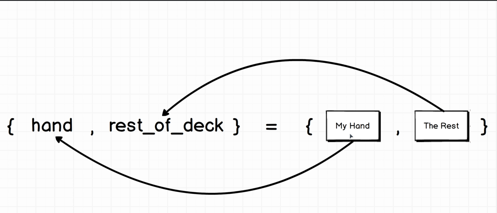
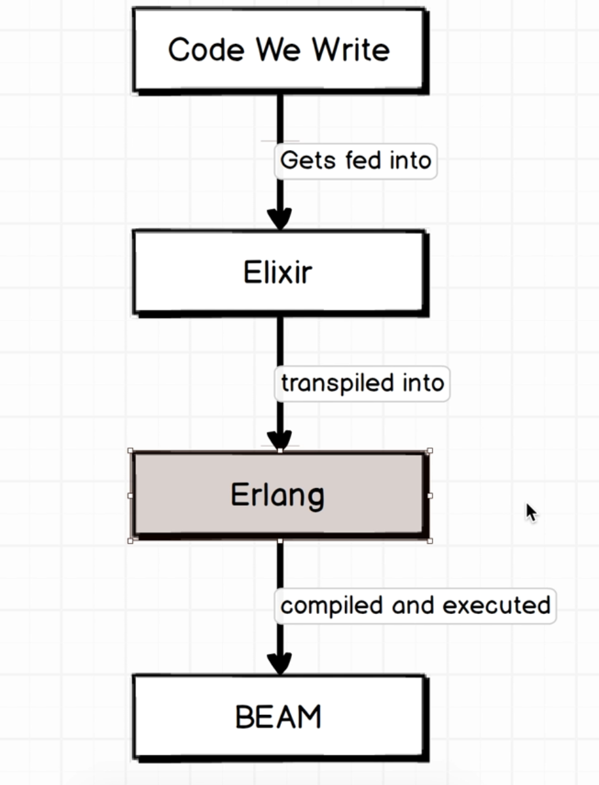

# Section 02 - Elixir's Amazing Pattern Matching

Pattern matching is Elixir replacement for variable assignment.

The simpler form of pattern matching is:

```elixir
deck = Cards.create_deck
```

To access a tuple using pattern matching:

```elixir
deck = Cards.create_deck
{ hand, rest_of_deck } = Cards.deal(deck, 5)

# Now we can access each variable
hand
rest_of_deck
```

The equal sign `=` start our pattern matching sequence. We write a tuple on the left hand side because tha is the same data structure on the right hand side and it has an equal number of elements. With that all the elements from the right hand side get assign to the ones on the left.



So to assign we need to have a **pattern** that **match** the type and number of elements on the left hand side.

Anytime you se equals we need to think in patter matching. It remembers the destructuring pattern on JavaScript.

```elixir
color = ["red"]
color # ["red"]

[ color ] = ["red"]
color # "red"

[ color1, color2 ] = ["red", "blue"]
color1 # "red"
color2 # "blue"
```

> The entire Elixir language is built on this concept of Patter Matching.

## Elixir's Relationship with Erlang

Elixir is not standalone language, it runs in Erlang. They have different syntax but nearly identical underlining concepts.

Erlang was build for large telecoms companies for handling telecoms network. The syntax is difficult to understand.

We can think of Elixir as a dialect of Erlang, but all the code get run in Erlang at the end. Elixir purpose is to give us a better interface to Erlang.



The BEAM is a virtual machine where all our Erlang code is executed, similar to the JVM.

There are some functionality that Elixir don't provide and we then use Erlang.

## Saving to the file system

For this we need to use Erlang:

```elixir
def save(deck, filename) do
  binary = :erlang.term_to_binary(deck)
  File.write(filename, binary)
end
```

To save a deck we can:

```elixir
deck = Cards.create_deck
Cards.save(deck, 'my_deck')
```

This will save our deck in the file system.

## Load from file

We use Erlang again to read the file:

```elixir
def load(filename) do
  {_status, binary} = File.read(filename)
  :erlang.binary_to_term(binary)
end
```

If we don't use a variable we can start it with an underscore `_` like in `_status`.

To load a deck we can:

```elixir
Cards.load('my_deck')
```

## Handling errors

If we where using JS we could think to do something like:

```elixir
def load(filename) do
  {status, binary} = File.read(filename)
  if(status === :error) {
    return "Something went wrong";
  }
  :erlang.binary_to_term(binary)
end
```

But in Elixir we need to avoid using `if` statements whenever possible.

Instead we use patter matching:

```elixir
def load(filename) do
  {status, binary} = File.read(filename)

  case status do
    :ok -> :erlang.binary_to_term binary
    :error -> "That file does not exist"
  end
end
```

## Atoms

Every time we see a `:` before a variable name that means it is a atom data structure. Like in `:ok` and `:error`.

They are used in Elixir to handle status codes. They are like strings.

## Patter Matching in Case Statements

If we put a hard code value on the left Elixir will require that on te right side:

```elixir
["red", color] = ["red", "blue"]
color # "blue"

["red", color] = ["green", "blue"]
color # gives an error
```

We can update our load method:

```elixir
def load(filename) do
  case File.read(filename) do
    {:ok, binary} -> :erlang.binary_to_term binary
    {:error, _reason} -> "That file does not exist"
  end
end
```

## Pipe Operator

The pipe operator chain methods passing the result as the first argument for the next call.

```elixir
def create_hand(hand_size) do
  Cards.create_deck
  |> Cards.shuffle
  |> Cards.deal(hand_size) # deal first argument is the deck returned from the shuffle
end
```

You need to keep that in mind when you write your methods, the importance of the first argument passed down by the pipe operator.

Pattern Matching and the Pipe Operator are the corner stones of Elixir.
